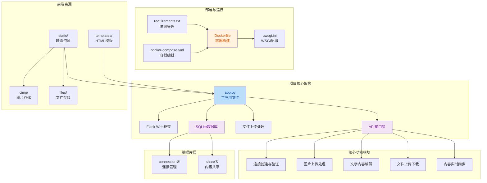

# 教师与班级连接管理及文件传输系统

## 项目简介

**教师与班级连接管理及文件传输系统** 是一个轻量级的课堂辅助工具，基于 Python Flask 框架开发，用于教师与班级之间的连接管理、图片和文字内容的实时传输与共享。

### 主要特点

- 🔑 **密钥连接**：生成20位唯一数字密钥，教师与班级通过密钥建立连接
- 🖼️ **图片上传**：支持多图片上传，自动保存到服务器
- 📝 **文字传输**：支持富文本内容编辑与传输
- 📄 **文件共享**：支持多种文档格式（PDF、Word、Excel等）上传与下载
- 🔄 **实时刷新**：班级端自动刷新显示最新内容
- 📱 **响应式布局**：适配不同屏幕尺寸，手机/电脑均可使用
- 🛡️ **安全防护**：SQL注入防护、XSS防护、文件类型限制

***

## 技术栈

### 后端框架

- **Flask 3.0.0** - Web应用框架
- **Python 3.7+** - 编程语言

### 数据库

- **SQLite 3** - 轻量级关系型数据库

### 前端技术

- **HTML5** - 页面结构
- **CSS3** - 样式设计
- **JavaScript (AJAX)** - 前端交互

### 部署

- **uWSGI 2.0.24** - WSGI应用服务器
- **Docker** - 容器化部署

***

## 项目架构



## 功能模块

### 1. 连接管理系统

#### 1.1 创建连接

- 教师输入连接名称
- 系统自动生成20位唯一数字密钥
- 密钥与连接名称绑定存储
- 支持创建多个连接

#### 1.2 验证连接

- 班级端输入20位连接密钥
- 系统验证密钥有效性
- 验证成功后显示连接名称
- 支持密钥记忆功能（Cookie存储）

***

### 2. 内容编辑与共享

#### 2.1 图片上传

- 支持多图片同时上传
- 支持格式：png, jpg, jpeg, gif, bmp, webp
- 自动生成随机文件名防止冲突
- 图片自动保存到 static/cimg 目录

#### 2.2 文字编辑

- 支持纯文本内容输入
- 支持内容覆盖更新
- 实时保存到数据库

#### 2.3 文件共享

- 支持多文件同时上传
- 支持格式：pdf, doc, docx, xls, xlsx, ppt, pptx, txt, zip, rar
- 保留原始文件名显示
- 支持文件下载功能

#### 2.4 内容同步

- 班级端每5秒自动刷新
- 显示最新的图片和文字内容
- 图片与文字分栏显示（左图右文）

***

### 3. 安全特性

#### 3.1 SQL注入防护

- 使用参数化查询
- 防止恶意SQL注入攻击

#### 3.2 XSS攻击防护

- 输入内容转义处理
- 防止跨站脚本攻击

#### 3.3 文件安全

- 严格限制文件上传类型
- 防止恶意文件上传
- 文件名安全处理

#### 3.4 Cookie安全

- 设置 Secure、HttpOnly、SameSite 属性
- 防止Cookie被窃取

***

## 项目结构

```
teacher-class-connector/
├── app.py                      # Flask应用主文件
├── database.py                 # 数据库操作模块
├── requirements.txt            # Python依赖
├── uwsgi.ini                   # uWSGI配置文件
├── Dockerfile                  # Docker镜像构建文件
├── docker-compose.yml          # Docker Compose配置
├── README.md                   # 项目文档
├── app.db                      # SQLite数据库文件（自动生成）
│
├── templates/                  # HTML模板
│   ├── index.html             # 首页
│   ├── teacher.html           # 教师管理页面
│   ├── class.html             # 班级课堂页面
│   └── editor.html            # 图片编辑器页面
│
└── static/                     # 静态资源
    ├── cimg/                  # 上传的图片存储目录（自动创建）
    └── files/                 # 上传的文件存储目录（自动创建）
```

***

## 快速开始

### 环境要求

- Python 3.7+
- Docker (可选)

### 本地开发

#### 1. 克隆项目

```bash
git clone https://github.com/snyqt/teacher-class-connector.git
cd teacher-class-connector
```

#### 2. 安装依赖

```bash
pip install -r requirements.txt
```

#### 3. 启动应用

```bash
python app.py
```

#### 4. 访问应用

打开浏览器访问：http://127.0.0.1:5000

***

## 部署说明

### 方式一：Docker 部署（推荐）

#### 环境要求

- Docker
- Docker Compose

#### 快速启动

1. **构建并启动容器**
   ```bash
   docker-compose up -d
   ```

2. **访问应用**
   
   打开浏览器访问：http://127.0.0.1:5000

#### 常用命令

- 查看日志：`docker-compose logs -f`
- 停止服务：`docker-compose down`
- 重启服务：`docker-compose restart`

#### 数据持久化

数据会自动保存在以下位置：
- 数据库：`./app.db`
- 上传图片：`./static/cimg/`
- 上传文件：`./static/files/`

---

### 方式二：传统 Python 部署

#### 环境要求

- Python 3.7 或更高版本

#### 安装步骤

1. **克隆或下载项目**
   ```bash
   cd teacher-class-connector
   ```

2. **创建虚拟环境（推荐）**
   ```bash
   python -m venv venv
   venv\Scripts\activate  # Windows
   # 或
   source venv/bin/activate  # Linux/Mac
   ```

3. **安装依赖**
   ```bash
   pip install -r requirements.txt
   ```

4. **启动应用**
   ```bash
   python app.py
   ```

5. **访问应用**
   
   打开浏览器访问：http://127.0.0.1:5000

---

### 方式三：uWSGI 部署（推荐用于生产环境）

#### 环境要求

- Python 3.7 或更高版本
- Linux 系统（uWSGI 在 Windows 上支持有限，建议使用 WSL 或 Linux 服务器）
- GCC 编译器（用于编译 uWSGI）

#### 安装步骤（Linux）

1. **克隆或下载项目**
   ```bash
   cd /path/to/project
   ```

2. **创建虚拟环境（推荐）**
   ```bash
   python3 -m venv venv
   source venv/bin/activate
   ```

3. **安装系统依赖（Ubuntu/Debian）**
   ```bash
   sudo apt-get update
   sudo apt-get install -y python3-dev gcc
   ```

4. **安装 Python 依赖**
   ```bash
   pip install -r requirements.txt
   ```

5. **启动 uWSGI 服务**
   ```bash
   uwsgi --ini uwsgi.ini
   ```

#### 使用 systemd 管理 uWSGI 服务（推荐）

1. **创建 systemd 服务文件**
   ```bash
   sudo nano /etc/systemd/system/teacher-class-connector.service
   ```

2. **添加以下内容**（根据实际路径修改）：
   ```ini
   [Unit]
   Description=Teacher & Class Connector uWSGI Service
   After=network.target

   [Service]
   User=www-data
   Group=www-data
   WorkingDirectory=/path/to/project
   Environment="PATH=/path/to/project/venv/bin"
   ExecStart=/path/to/project/venv/bin/uwsgi --ini /path/to/project/uwsgi.ini

   [Install]
   WantedBy=multi-user.target
   ```

3. **启动并启用服务**
   ```bash
   sudo systemctl daemon-reload
   sudo systemctl start teacher-class-connector
   sudo systemctl enable teacher-class-connector
   ```

4. **查看服务状态**
   ```bash
   sudo systemctl status teacher-class-connector
   ```

#### 配合 Nginx 使用（推荐）

1. **创建 Nginx 配置文件**
   ```bash
   sudo nano /etc/nginx/sites-available/teacher-class-connector
   ```

2. **添加以下内容**：
   ```nginx
   server {
       listen 80;
       server_name your-domain.com;

       client_max_body_size 50M;

       location / {
           include uwsgi_params;
           uwsgi_pass 127.0.0.1:5000;
       }

       location /static {
           alias /path/to/project/static;
       }
   }
   ```

3. **启用配置并重启 Nginx**
   ```bash
   sudo ln -s /etc/nginx/sites-available/teacher-class-connector /etc/nginx/sites-enabled/
   sudo nginx -t
   sudo systemctl restart nginx
   ```

#### Windows 环境提示

uWSGI 在 Windows 上支持有限，建议：
- 使用 WSL (Windows Subsystem for Linux)
- 或者使用 Docker 部署
- 或者使用传统 Python 部署方式

***

## 使用说明

### 教师端操作流程

1. 访问 http://127.0.0.1:5000/teacher
2. 点击"创建连接"，输入连接名称
3. 系统生成20位连接密钥，请妥善保存
4. 输入连接密钥并确认
5. 上传图片（可多选）、文件（可多选）和输入文字内容
6. 点击"保存分享内容"

### 班级端操作流程

1. 访问 http://127.0.0.1:5000/class
2. 输入教师提供的20位连接密钥
3. 点击"连接课堂"
4. 自动显示共享内容，每5秒自动刷新
5. 可点击文件列表下载共享文件

***

## 数据库结构

### connection 表

- `key` (TEXT, PRIMARY KEY): 20位连接密钥
- `name` (TEXT): 连接名称

### share 表

- `id` (INTEGER, PRIMARY KEY): 自增ID
- `connection` (TEXT, FOREIGN KEY): 关联connection表的key
- `share` (TEXT): JSON格式的分享内容

***

## 注意事项

1. static/cimg 和 static/files 目录需要有读写权限
2. 首次运行会自动创建 app.db 数据库文件
3. 建议在生产环境中禁用 debug 模式
4. 生产环境请使用更安全的 SECRET_KEY 配置
5. 上传文件大小限制可在 Nginx 或 uWSGI 配置中调整

***

## 开发环境

当前版本已在以下环境测试通过：
- Python 3.8+
- Windows / Linux 操作系统
- Chrome/Firefox 浏览器
